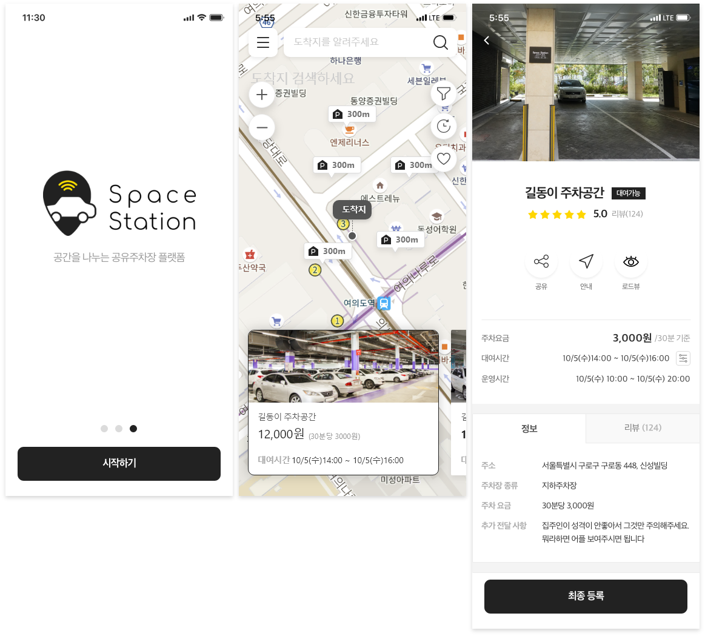
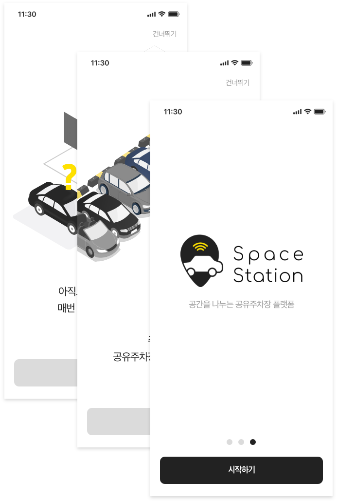
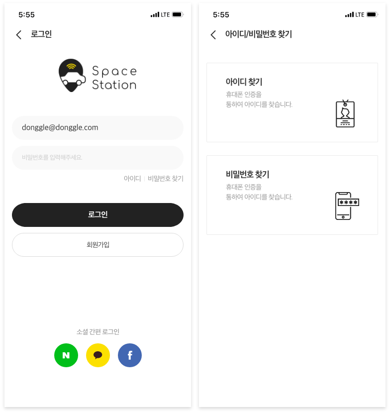
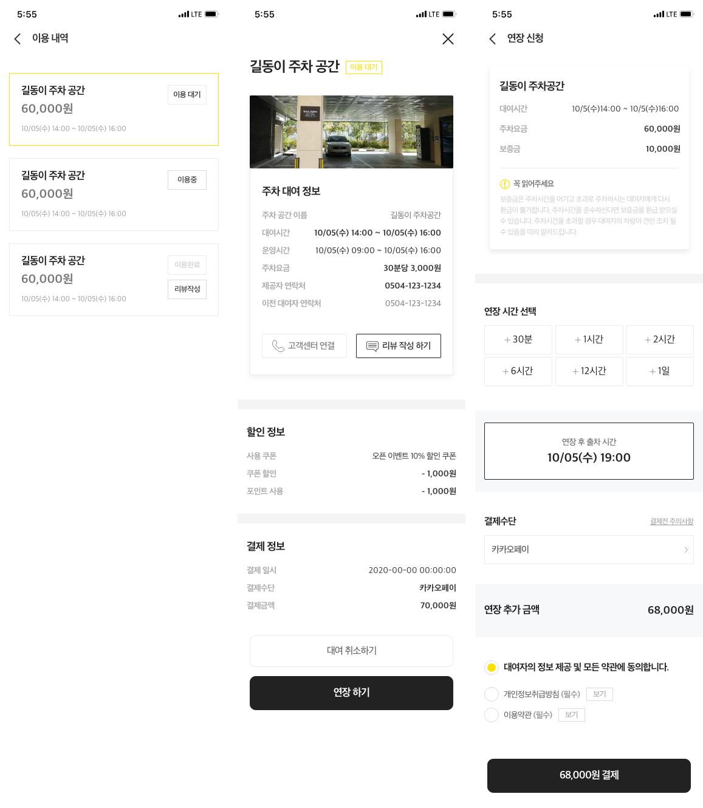
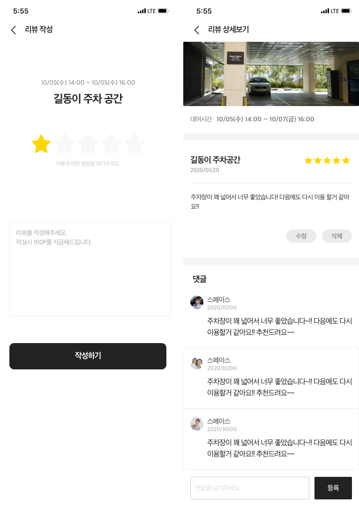

# 모두의 주차장

    공간을 나누는 공유주차장 플랫폼

## 개요

-   주차 정보 안내
-   주차장 공유(민영 주차공간 공유)
-   공유 및 제휴 주차장 요금 모바일 결제 / 할인예약
-   전국 공항 실시간 주차장 및 운항 정보(한국공항공사 제휴)
-   수도권 주차장 혼잡도 안내

## 기술 스택

-   React
-   Redux Saga
-   Swiper
-   kakao Maps API
-   SCSS
-   Express
-   MySQL
-   Sequelize

## 개발 인원 · 역할 · 기간

-   풀스택 1명, 프런트엔드 3명, 백엔드 1명
-   역할(프런트엔드)
    -   인트로
    -   로그인, 회원가입, 아이디/비밀번호 찾기
    -   이용내역(리스트 관리)
    -   리뷰(리스트, 글 작성, 댓글)
    

    
    
    
    
    

-   2개월 작업

## URL

https://intospace.kr/
